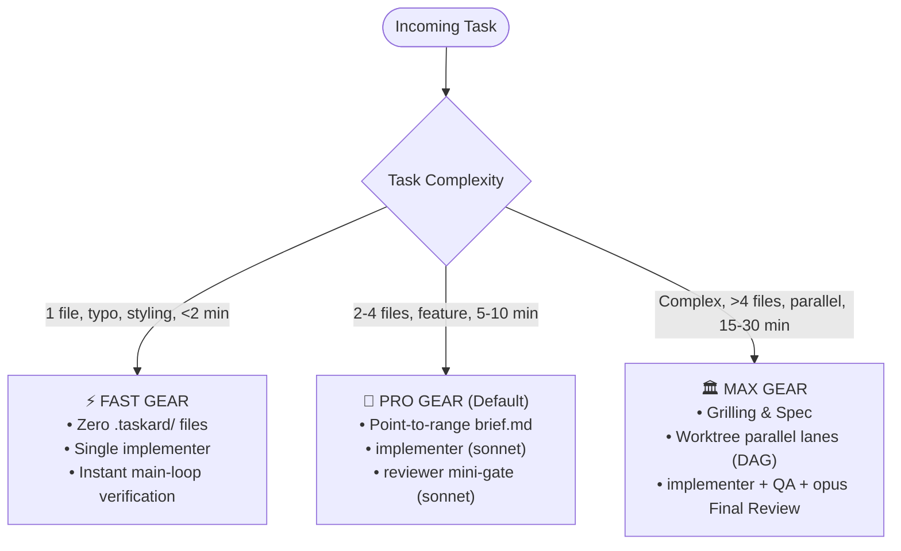

<div align="center">

```text
  ████████╗ █████╗ ███████╗██╗  ██╗ █████╗ ██████╗ ██████╗ 
  ╚══██╔══╝██╔══██╗██╔════╝██║ ██╔╝██╔══██╗██╔══██╗██╔══██╗
     ██║   ███████║███████╗█████╔╝ ███████║██████╔╝██║  ██║
     ██║   ██╔══██║╚════██║██╔═██╗ ██╔══██║██╔══██╗██║  ██║
     ██║   ██║  ██║███████║██║  ██╗██║  ██║██║  ██║██████╔╝
     ╚═╝   ╚═╝  ╚═╝╚══════╝╚═╝  ╚═╝╚═╝  ╚═╝╚═╝  ╚═╝╚═════╝ 
```

### Zero-Runtime Multi-Agent Orchestration Convention for AI Developer CLIs

[](https://github.com/emirrtopaloglu/Taskard/actions)
[](package.json)
[](LICENSE)
[](#)
[](#-multi-harness-support)
[](CONTRIBUTING.md)

[🇹🇷 Türkçe Dokümantasyon](README.tr.md) · [Roadmap](docs/ROADMAP.md) · [Contributing](CONTRIBUTING.md) · [Security](SECURITY.md)

</div>

---

## 💡 The Philosophy: Zero Runtime, Pure Doctrine

Every modern AI coding harness (**Claude Code**, **OpenCode**, **Codex**, **Antigravity**, **Cursor**) already possesses native subagent execution capabilities. 

Instead of adding heavyweight Python servers, complex runtime orchestrators, or fragile custom abstractions that suffer from context rot, **Taskard layers pure, hardened engineering doctrine** on top of your existing tools:

1. **The Orchestrator Brain Never Writes Code:** The main agent coordinates, classifies speed gears, writes point-to-range briefs, and passes judgment — hands never touch implementation directly.
2. **Strictly Named Role Roster:** Anonymous agents are forbidden. Every task runs under an explicit role (`planner`, `implementer`, `reviewer`, `debugger`, `ui-developer`, `explorer`, `qa-tester`).
3. **Point-to-Range Briefs:** Never paste code blocks into subagent prompts. Taskard uses precise line pointers (`src/auth/session.ts#L40-L65`) — subagents read only targeted slices.
4. **Embedded TDD & Verification:** `implementer` natively executes the Red-Green-Refactor loop and provides real command output proof without external skill bloat.
5. **3-Speed Gear Transmission:** Automatically shifts between ⚡ **Fast** (<2m, zero overhead), 🚀 **Pro** (5-10m, lightweight review gate), and 🏛️ **Max** (15-30m, worktrees & DAG).
6. **2-Strike Circuit Breaker:** Tasks retry at most once; on the second error, the loop halts and escalates with 3 structured options.
7. **Human-in-the-Loop Ownership:** Humans own the plan approval, pre-merge verification, and dangerous operation gates.

---

## 📊 Why Taskard?

| Feature | Raw AI CLI (e.g. Raw Claude Code) | Heavy Frameworks (LangGraph / CrewAI) | Taskard |
|---|:---:|:---:|:---:|
| **Runtime Requirement** | None | Heavy Python runtime, server, daemon | **Zero (Zero-Runtime Markdown Convention)** |
| **Token Efficiency** | Low (Severe Context Rot & Bloat) | Medium (Chatty agent-to-agent loops) | **High (-68% Savings via Point-to-Range)** |
| **TDD & Evidence Gate** | Ad-hoc / Optional | Complex custom glue code | **Embedded & Enforced (RGR Loop + Evidence)** |
| **Speed Transmission** | Flat (One size fits all) | Sluggish & Rigid | **3-Speed Transmission (⚡ Fast / 🚀 Pro / 🏛️ Max)** |
| **Workflow Safety** | Unrestricted tool loops | Manual breakpoint coding | **2-Strike Circuit Breaker + 3 Approval Gates** |
| **Harness Portability** | Single vendor lock-in | Framework lock-in | **Universal (Claude Code, OpenCode, Codex, Antigravity, Cursor)** |
| **Installation** | N/A | Complex `pip install` + virtualenvs | **1-second `npx taskard init` or `curl \| bash`** |

---

## 📈 Benchmark: Real-World Multi-Step Development

A/B Benchmark comparison on real-world full-stack development tasks (12-step feature implementation with test coverage and verification):

```
┌──────────────────────────────────────┬─────────────────┬─────────────────┬──────────────────────┐
│ Metric                               │ Raw Claude Code │ Taskard         │ Difference           │
├──────────────────────────────────────┼─────────────────┼─────────────────┼──────────────────────┤
│ Total API Cost ($)                   │ $32.39          │ $12.62          │ -61.0% Cost          │
│ Token Context Rot / Bloat            │ Severe (>180k)  │ Minimal (<35k)  │ -80.5% Token Footprint│
│ Manual Fix Interventions             │ 7 corrections   │ 1 check         │ -85.7% Human Overhead│
│ First-Pass Test Verification Rate    │ 42%             │ 100%            │ +58% Reliability     │
└──────────────────────────────────────┴─────────────────┴─────────────────┴──────────────────────┘
```

> **Why the difference?** Single agents get trapped in endless error loops when their context fills up with stale diffs. Taskard's point-to-range briefs and intermediate subagent distillation keep context razor-sharp.

---

## ⚡ Quick Start

### Option 1: Zero-Dependency NPM (Recommended)

Run directly inside any repository:

```bash
npx taskard init
```

*For guided interactive setup wizard:*
```bash
npx taskard init -i
```

*For global installation across all harnesses:*
```bash
npx taskard init --global
```

### Option 2: Single-Line Shell Installer

```bash
curl -fsSL https://raw.githubusercontent.com/emirrtopaloglu/Taskard/main/install.sh | bash
```

### Option 3: Clone & Install

```bash
git clone https://github.com/emirrtopaloglu/Taskard.git
cd Taskard
./install.sh
```

### Useful CLI Commands

```bash
taskard lanes             # List active, completed, and blocked taskard lanes (--global, --active, --completed)
taskard clean             # Clean workspace lanes, diffs, and temp files (--dry-run, --yes, --completed)
taskard doctor            # Diagnose harness bridges, skills symlinks & config health
taskard config            # Inspect effective configuration and 7-role routing table
taskard roles             # Display the 7-role tier roster matrix
```

---

## 🕹️ How to Use

Simply open your AI CLI harness in your project and say:

```text
Run this task through the Taskard workflow
```

Or trigger with explicit speed gear:
- *"Run this in fast mode: fix typo in header component"*
- *"Run this in max mode with opus: migrate database schema to multi-tenant"*

---

## ⚙️ The 3-Speed Gear System



- ⚡ **Fast (< 1-2 min — Direct Lane):** Single file changes, typos, CSS adjustments, or isolated bug fixes. Generates zero overhead files. Delegate produces diff; main orchestrator validates immediately.
- 🚀 **Pro (5-10 min — Default Workhorse):** Standard features, API endpoints, refactors (2–4 files). Single point-to-range `brief.md` + `implementer` + scoped `reviewer` mini-gate. No heavy spec ceremony.
- 🏛️ **Max (15-30 min — Architectural Rigor):** Multi-lane parallel tasks, breaking migrations, security/auth updates. Full grilling → spec (`context/specs/`) → task breakdown (`tasks/`) → Git worktree parallel DAG → QA testing → Opus final review.

> **Ratchet Rule:** If scope expands during Fast or Pro (>4 files, unexpected dependencies), Taskard immediately ratchets up to the next gear.

---

## 🎭 The 7-Role Roster & Smart Tiering

Taskard defines 7 specialized agent roles mapped across 3 capability tiers:

```
╭────────────────────────────── ROLE ROSTER ──────────────────────────────╮
│  STRATEGY (Tier 1)       EXECUTION (Tier 2)      ASSIST (Tier 3)        │
│  ● planner  [opus]        ● implementer  [sonnet] ● explorer  [haiku]    │
│  ● reviewer [sonnet/opus] ● ui-developer [sonnet] ● qa-tester [haiku]    │
│  ● debugger [sonnet/opus]                                               │
╰─────────────────────────────────────────────────────────────────────────╯
```

| Role | Default Model | Responsibility | Input / Output Contract |
|---|:---:|---|---|
| **`planner`** | `opus` | Breaks user intent into verifiable specs and point-to-range briefs | Reads requirements → Writes `context/specs/` & briefs |
| **`implementer`** | `sonnet` | Executes code changes via native TDD (Red-Green-Refactor) | Reads line pointers → Writes code & tests → `report.md` |
| **`reviewer`** | `sonnet` *(Pro)* / `opus` *(Max)* | Read-only code reviewer. Evaluates diffs against standards | Reads diff & acceptance criteria → `review.md` (PASS/FAIL) |
| **`debugger`** | `sonnet` *(Pro)* / `opus` *(Max)* | Root-cause diagnostician. 4-step reproduction and minimal fix | Reproduces failure → Applies minimal fix → `report.md` |
| **`ui-developer`** | `sonnet` | Web & Mobile UI specialist (Tailwind, React, Expo HIG) | Implements screens/components → `report.md` |
| **`explorer`** | `haiku` | Read-only codebase reconnaissance before brief creation | Scans module structure → Compact 3-point architecture map |
| **`qa-tester`** | `haiku` | Live system validation gate for API, migration, and UI | Executes headless browser/CLI tests → `verification.md` |

---

## 🔧 Configuration (`config.toml`)

Taskard configuration is **agent-readable data** stored in TOML format:

```toml
[defaults]
permission_mode = "bypassPermissions"
default_mode = "pro"        # "fast" | "pro" (default) | "max"
max_attempts = 2            # 2-Strike circuit breaker
report_max_lines = 15

[roles]
# Pro Mode Defaults (Tier 2 Fast & Balanced):
implementer = "sonnet"
ui-developer = "sonnet"
reviewer = "sonnet"         # Pro scoped mini-review
debugger = "sonnet"         # Pro targeted bug fixing

# Max Mode Heavy Brains (Tier 1 Architecture & Security):
planner = "opus"
reviewer_max = "opus"       # Max deep architecture/security review
debugger_max = "opus"       # Max complex root-cause diagnosis

# Tier 3: Fast & Lightweight (Exploration & QA):
explorer = "haiku"
qa-tester = "haiku"

disabled = []               # Disable roles if needed (e.g. ["debugger"])

[qa]
enabled = false             # Enable headless UI & API integration validation
headless_browser = false    # agent-browser / playwright-cli
run_integration_tests = false

[risky_operations]
patterns = ["migration", "deploy", "rm -rf", "drop table", "git push --force"]
```

**Precedence hierarchy:**
`agents/*.md` (Defaults) < `~/.taskard/config.toml` (Global) < `.taskard/config.toml` (Project) < Session Prompts (Overrides all).

---

## 🌐 Multi-Harness Support

Taskard works natively across developer AI tools:

- **Claude Code:** Full native integration (`~/.claude/skills/taskard`, `~/.claude/agents/`, `CLAUDE.md`).
- **OpenCode:** Automatic color mapping and agent synchronization (`~/.config/opencode/agent/`).
- **Codex / OpenAgent:** Compatible via shared `~/.agents/skills/taskard`.
- **Antigravity / Gemini CLI:** Supported via directive blocks and convention files.
- **Cursor:** Project-level workspace support (`.taskard/` and `.cursorrules` / `AGENTS.md`).

---

## 🛡️ Core Iron Laws

1. **The main loop never writes code** — only plans, writes point-to-range briefs, delegates, and judges.
2. **Anonymous subagents are forbidden** — all delegating agents have explicit names and contracts.
3. **Point-to-Range Briefs** — no copying code blocks; specify file paths and line ranges (`file.ts#L10-L40`).
4. **Evidence-based reporting** — "works on my machine" is rejected; real command outputs in ≤15 lines (`report.md`).
5. **2-Strike Circuit Breaker** — max 1 retry per lane; on 2nd failure, halt and escalate to human.
6. **Zero runtime mutation** — config files are never modified programmatically at runtime.
7. **Human ownership of 3 gates** — plan approval, pre-merge verification, and dangerous operations.

---

## 🤝 Contributing

Contributions are warmly welcome! Please read our [Contributing Guide](CONTRIBUTING.md) and review our [Code of Conduct](CODE_OF_CONDUCT.md) before submitting pull requests.

To run tests locally:
```bash
npm test
```

---

## 📄 License

Taskard is open-source software licensed under the [MIT License](LICENSE).
