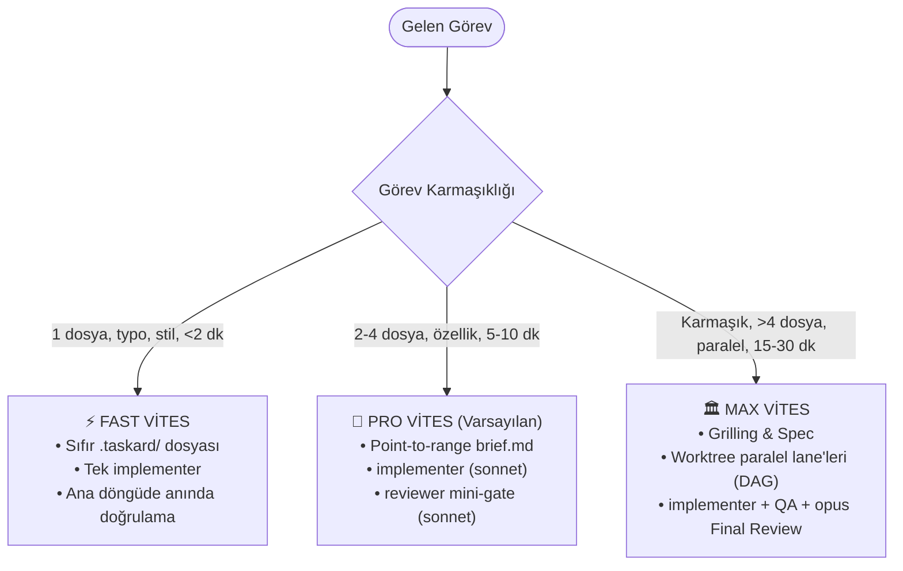

<div align="center">

```text
  ████████╗ █████╗ ███████╗██╗  ██╗ █████╗ ██████╗ ██████╗ 
  ╚══██╔══╝██╔══██╗██╔════╝██║ ██╔╝██╔══██╗██╔══██╗██╔══██╗
     ██║   ███████║███████╗█████╔╝ ███████║██████╔╝██║  ██║
     ██║   ██╔══██║╚════██║██╔═██╗ ██╔══██║██╔══██╗██║  ██║
     ██║   ██║  ██║███████║██║  ██╗██║  ██║██║  ██║██████╔╝
     ╚═╝   ╚═╝  ╚═╝╚══════╝╚═╝  ╚═╝╚═╝  ╚═╝╚═╝  ╚═╝╚═════╝ 
```

### AI Geliştirici CLI'ları İçin Sıfır-Çalışma-Zamanlı Çoklu-Ajan Orkestrasyon Konvansiyonu

[](https://github.com/emirrtopaloglu/Taskard/actions)
[](package.json)
[](LICENSE)
[](#)
[](#-çoklu-harness-desteği)
[](CONTRIBUTING.md)

[English Documentation](README.md) · [Roadmap](docs/ROADMAP.md) · [Katkı Rehberi](CONTRIBUTING.md) · [Güvenlik](SECURITY.md)

</div>

---

## 💡 Felsefe: Sıfır Çalışma Zamanı, Saf Mühendislik Doktrini

Modern AI kodlama araçlarının tümü (**Claude Code**, **OpenCode**, **Codex**, **Antigravity**, **Cursor**) kendi içinde yerleşik subagent çalıştırma yeteneğine sahiptir.

Taskard, sisteminize ağır Python sunucuları, karmaşık orkestrasyon bağımlılıkları veya bağlam körlüğüne (context rot) yol açan hantal katmanlar eklemek yerine, **mevcut araçlarınızın üzerine test edilmiş saf mühendislik doktrini** yerleştirir:

1. **Ana Orkestratör Asla Kod Yazmaz:** Ana ajan yalnızca işi sınıflandırır, point-to-range brief yazar, delegeleri açar ve sonuçları yargılar — eli asla koda değmez.
2. **Adlandırılmış Rol Kadrosu:** İsimsiz subagent yasaktır. Her iş sözleşmesi tanımlı bir role atanır (`planner`, `implementer`, `reviewer`, `debugger`, `ui-developer`, `explorer`, `qa-tester`).
3. **Point-to-Range Brief Standardı:** Brief'e asla kod yapıştırılmaz. Yalnızca hedef dosya ve satır aralığı pointer'ı (`src/auth/session.ts#L40-L65`) verilir; delege yalnızca o aralığı okur.
4. **Yerleşik TDD & Kanıt Kapısı:** `implementer`, Red-Green-Refactor döngüsünü ve komut çıktısı kanıtını harici skill şişkinliği olmadan yerleşik olarak işletir.
5. **3 Kademeli Hız Şanzımanı:** Göreve göre ⚡ **Fast** (<2 dk, sıfır dosya), 🚀 **Pro** (5-10 dk, hızlı mini-review), ve 🏛️ **Max** (15-30 dk, worktree DAG) arasında otomatik vites değiştirir.
6. **2-Strike Devre Kesici (Circuit Breaker):** Bir lane en fazla 1 kez düzeltme dener; 2. hatada akış durur ve 3 net seçenekle kullanıcıya eskalasyon yapılır.
7. **İnsan Onay Kapıları:** Plan onayı, merge öncesi canlı doğrulama ve riskli işlemler her zaman insanın kontrolündedir.

---

## 📊 Neden Taskard?

| Özellik | Ham AI CLI (Örn. Claude Code) | Ağır Çerçeveler (LangGraph / CrewAI) | Taskard |
|---|:---:|:---:|:---:|
| **Runtime İhtiyacı** | Yok | Ağır Python sunucusu, arka plan servisleri | **Sıfır (Zero-Runtime Markdown Konvansiyonu)** |
| **Token Verimliliği** | Düşük (Şiddetli Bağlam Körlüğü / Rot) | Orta (Sürekli ajanlar arası gevezelik) | **Yüksek (-%68 Tasarruf / Point-to-Range)** |
| **TDD & Kanıt Kapısı** | İsteğe bağlı / Ad-hoc | Karmaşık özel kodlar | **Yerleşik & Zorunlu (RGR Döngüsü + Kanıt)** |
| **Hız Şanzımanı** | Tek düze (Herkese aynı muamele) | Hantal ve esnek olmayan | **3 Kademeli Şanzıman (⚡ Fast / 🚀 Pro / 🏛️ Max)** |
| **İş Akışı Güvenliği** | Başıboş araç döngüleri | Elle breakpoint kodlama | **2-Strike Devre Kesici + 3 İnsan Onay Kapısı** |
| **Taşınabilirlik** | Tek üretici bağımlılığı | Çerçeve bağımlılığı | **Evrensel (Claude Code, OpenCode, Codex, Antigravity, Cursor)** |
| **Kurulum** | — | Zorlu `pip install` + virtualenv | **1 saniyede `npx taskard init` veya `curl \| bash`** |

---

## 📈 Benchmark: Gerçek Projelerde Çok Adımlı Geliştirme

Gerçek dünya senaryolarında 12 adımlı uçtan uca özellik geliştirme ve test doğrulamasında A/B karşılaştırması:

```
┌──────────────────────────────────────┬─────────────────┬─────────────────┬──────────────────────┐
│ Metrik                               │ Ham Claude Code │ Taskard         │ Fark                 │
├──────────────────────────────────────┼─────────────────┼─────────────────┼──────────────────────┤
│ Toplam API Maliyeti ($)              │ $32.39          │ $12.62          │ -%61.0 Tasarruf      │
│ Token Bağlam Şişkinliği (Context Rot)│ Şiddetli (>180k)│ Minimal (<35k)  │ -%80.5 Token Ayak İzi│
│ İnsan Düzeltme / Müdahale Sayısı     │ 7 düzeltme      │ 1 kontrol       │ -%85.7 İnsan Yükü    │
│ İlk Geçişte Test Doğrulama Oranı     │ %42             │ %100            │ +%58 Güvenilirlik    │
└──────────────────────────────────────┴─────────────────┴─────────────────┴──────────────────────┘
```

> **Farkın sebebi ne?** Tekli ajanlar hafızaları eski diff'lerle doldukça aynı hataları tekrarlar. Taskard'ın point-to-range brief'leri ve ara subagent özet süzgeci bağlamı daima taze tutar.

---

## ⚡ Hızlı Kurulum

### Seçenek 1: Sıfır Bağımlılıklı NPM (Önerilen)

Herhangi bir proje dizininde doğrudan çalıştırın:

```bash
npx taskard init
```

*Etkileşimli sihirbaz ile adım adım yapılandırma:*
```bash
npx taskard init -i
```

*Tüm harness'lar için global kurulum:*
```bash
npx taskard init --global
```

### Seçenek 2: Tek Satırlık Shell Kurulumu

```bash
curl -fsSL https://raw.githubusercontent.com/emirrtopaloglu/Taskard/main/install.sh | bash
```

### Seçenek 3: Klonla & Kur

```bash
git clone https://github.com/emirrtopaloglu/Taskard.git
cd Taskard
./install.sh
```

### Faydalı CLI Komutları

```bash
taskard lanes             # Aktif, tamamlanan ve bloklanan lane'leri listele (--global, --active, --completed)
taskard clean             # Çalışma alanındaki lane'leri, diff'leri ve geçici dosyaları temizle (--dry-run, --yes, --completed)
taskard doctor            # Harness köprülerini, skill symlink'lerini ve yapılandırma sağlığını denetle
taskard config            # Etkin yapılandırmayı ve 7 rolün model yönlendirme tablosunu incele
taskard roles             # 7 rollü kademe matrisini göster
```

---

## 🕹️ Kullanım

Proje dizininde AI CLI'ınızı açın ve şunu söyleyin:

```text
Taskard akışıyla <görev tanımı>
```

Veya doğrudan vites belirterek başlatın:
- *"Bunu fast modda yap: header bileşenindeki yazım hatasını düzelt"*
- *"Bunu max modda opus ile yap: veritabanı şemasını çok kiracılı yapıya geçir"*

---

## ⚙️ 3 Kademeli Hız Şanzımanı



- ⚡ **Fast (< 1-2 dk — Doğrudan Hızlı Hat):** Tek dosya, typo, stil/CSS düzeltmesi. `.taskard/` altına dosya yazılmaz. Delege diff üretir, ana döngü diff'i doğrular ve sunar.
- 🚀 **Pro (5-10 dk — Varsayılan İş Atı):** 2–4 dosyalık özellikler, yeni bileşenler, endpoint'ler, küçük refactor'lar. Tek `brief.md` + `implementer` + `reviewer` mini-gate. Grilling ve spec seremonisi yoktur.
- 🏛️ **Max (15-30 dk — Tam Mimari Seremoni):** Karmaşık mimari, ≥2 paralel lane (git worktree), veri migration/auth. Grilling → Spec (`context/specs/`) → Tasks (`tasks/`) → Paralel Lane DAG → QA → Opus Final Review.

> **Ratchet Kuralı:** Fast veya Pro sırasında kapsam genişlerse (>4 dosya, beklenmeyen bağımlılık), akış derhal bir üst vitese yükseltilir.

---

## 🎭 7 Rol Kadrosu & Akıllı Model Matrisi

```
╭────────────────────────────── ROLE ROSTER ──────────────────────────────╮
│  STRATEGY (Tier 1)       EXECUTION (Tier 2)      ASSIST (Tier 3)        │
│  ● planner  [opus]        ● implementer  [sonnet] ● explorer  [haiku]    │
│  ● reviewer [sonnet/opus] ● ui-developer [sonnet] ● qa-tester [haiku]    │
│  ● debugger [sonnet/opus]                                               │
╰─────────────────────────────────────────────────────────────────────────╯
```

| Rol | Varsayılan Model | Sorumluluk | Girdi / Çıktı Sözleşmesi |
|---|:---:|---|---|
| **`planner`** | `opus` | Kullanıcı niyetini spec ve point-to-range brief'lere böler | İhtiyaçları okur → `context/specs/` & brief yazar |
| **`implementer`** | `sonnet` | Kodu yerleşik TDD (Red-Green-Refactor) ile uygular | Satır pointer'larını okur → Kod & test yazar → `report.md` |
| **`reviewer`** | `sonnet` *(Pro)* / `opus` *(Max)* | Salt-okunur kod incelemesi. Diff'i standartlara göre değerlendirir | Diff & kriterleri okur → `review.md` (PASS/FAIL) |
| **`debugger`** | `sonnet` *(Pro)* / `opus` *(Max)* | Kök neden avcısı. 4 adımlı teşhis ve minimal müdahale | Hatayı yeniden üretir → Minimal fix uygular → `report.md` |
| **`ui-developer`** | `sonnet` | Web ve Mobil UI geliştirme (Tailwind, React, Expo HIG) | Arayüz ve bileşen geliştirir → `report.md` |
| **`explorer`** | `haiku` | Brief öncesi salt-okunur kod tabanı keşfi | Modül yapısını tarar → 3 maddelik mimari harita |
| **`qa-tester`** | `haiku` | Canlı sistem doğrulaması (API, migration, UI) | Headless tarayıcı/CLI testleri çalıştırır → `verification.md` |

---

## 🔧 Konfigürasyon (`config.toml`)

Taskard konfigürasyonu **ajanlar tarafından okunan TOML verisidir**:

```toml
[defaults]
permission_mode = "bypassPermissions"
default_mode = "pro"        # "fast" | "pro" (varsayılan) | "max"
max_attempts = 2            # 2-Strike kuralı: 1 düzeltme, 2. hatada eskalasyon
report_max_lines = 15

[roles]
# Pro Mod Varsayılanları (Tier 2 Hızlı & Dengeli):
implementer = "sonnet"
ui-developer = "sonnet"
reviewer = "sonnet"         # Pro mini-review
debugger = "sonnet"         # Pro hedefli fix

# Max Mod Ağır Beyinleri (Tier 1 Mimari & Güvenlik):
planner = "opus"
reviewer_max = "opus"       # Max mimari & güvenlik
debugger_max = "opus"       # Max derin kök-neden

# Tier 3: Işık Hızında Asistanlar (Keşif & QA):
explorer = "haiku"
qa-tester = "haiku"

disabled = []               # İstemediğin rolleri kapatabilirsin (örn. ["debugger"])

[qa]
enabled = false             # Canlı headless testleri açar
headless_browser = false    # agent-browser / playwright-cli
run_integration_tests = false

[risky_operations]
patterns = ["migration", "deploy", "rm -rf", "drop table", "git push --force"]
```

**Öncelik sırası:**
`agents/*.md` < `~/.taskard/config.toml` (Global) < `.taskard/config.toml` (Proje) < Oturum Sözü (Hepsini ezer).

---

## 🌐 Çoklu-Harness Desteği

- **Claude Code:** Tam yerel entegrasyon (`~/.claude/skills/taskard`, `~/.claude/agents/`, `CLAUDE.md`).
- **OpenCode:** Otomatik renk eşlemesi ve ajan senkronizasyonu (`~/.config/opencode/agent/`).
- **Codex / OpenAgent:** Ortak `~/.agents/skills/taskard` üzerinden uyumlu.
- **Antigravity / Gemini CLI:** Direktif blokları ve konvansiyon dosyalarıyla desteklenir.
- **Cursor:** Proje düzeyinde `.taskard/` ve `.cursorrules` / `AGENTS.md` ile çalışır.

---

## 🛡️ Demir Kurallar

1. **Ana döngü asla kod yazmaz** — planlar, point-to-range brief yazar, delege açar ve yargılar.
2. **İsimsiz subagent yasaktır** — tüm delegelerin adı ve sözleşmesi bellidir.
3. **Point-to-Range Brief Standardı** — kod kopyalanmaz; dosya yolu ve satır aralığı (`file.ts#L10-L40`) verilir.
4. **Kanıtlı raporlama** — "çalışıyor" demek yasaktır; somut komut çıktısı ≤15 satırda (`report.md`) sunulur.
5. **2-Strike Devre Kesici** — lane başına max 1 retry; 2. hatada durup insana sorulur.
6. **Sıfır çalışma zamanı mutasyonu** — config dosyaları çalışma anında kod ile değiştirilmez.
7. **3 İnsan onay kapısı** — plan onayı, merge öncesi doğrulama ve riskli işlemler.

---

## 🤝 Katkıda Bulunma

Katkılarınızı bekliyoruz! Lütfen başlamadan önce [Katkı Rehberi](CONTRIBUTING.md) ve [Davranış Kuralları](CODE_OF_CONDUCT.md) sayfalarımızı inceleyin.

Testleri çalıştırmak için:
```bash
npm test
```

---

## 📄 Lisans

Taskard, [MIT Lisansı](LICENSE) altında açık kaynaklı bir yazılımdır.
